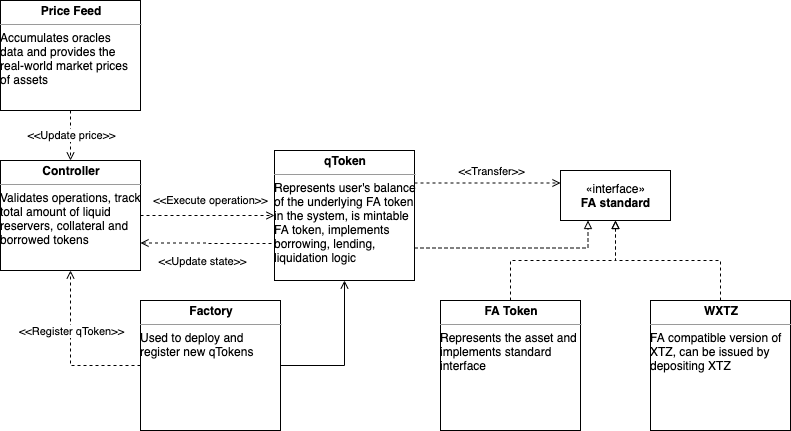

# BasicLendingProtocol

# Description
Landing Protocol contracts are under development. In this repository, you can follow the development and changes.

# Architecture



1. `Factory` - singleton used to deploy new qToken (FA1.2) contract;
2. `Controller` - the contract is responsible for the verification all the actions that can be done over the **qToken**;
3. `qToken` - extended FA1.2 that wraps any FA1.2;
4. `XTZ` - extended FA1.2;
5. `getOracle` - test contact created for setting token prices.

# Project structure

```
.
.
├──  contracts/ # contracts
├──────────  main/ # the contracts to be compiled
├───────────────────  Controller
├───────────────────  Factory
├───────────────────  getOracle
├───────────────────  Migrations
├───────────────────  qToken
├───────────────────  qToken.tz
├───────────────────  XTZ
├──────────  partials/ # the code parts imported by main contracts
├───────────────────  IController
├───────────────────  IFactory
├───────────────────  IXTZ
├───────────────────  MainTypes
├───────────────────  qTokenMethods
├──  scripts/ # cli for account actions
├──  storage/ # initial storage for contract originations
├──  test/ # test cases
├──  README.md # current file
└──  .gitignore
```

# Contracts

The Ligo interfaces of the contracts can be found in `contracts/partials/I__CONTRACT_NAME__.ligo`

## Wrapped XTZ
Extended FA1.2 token with mint/withdraw functions, analog for WETH.

## qToken
The main token with the following main features that have already been implemented:
- mint is a function to add a token as a collateral. It is she who allows you to add a token to our system.
- borrow - a function for borrowing a token. Implemented the logic of freezing collatiral tokens when borrowing a token.
- repay - a function designed to repay debt.
- redeem - the function is designed to withdraw tokens from the platform.
- liquidate - the function allows another user to liquidate someone's debt.

## Controller
The contract is responsible for the verification all the actions that can be done over the **qToken**.

## Factory
A contract that allows you to wrap a token (for example, wrapped XTZ) into our qXTZ token.

## getOracle
Implemented to send data on the price of a token (similar to harbinger contracts). This will allow us to test the entire project locally and use the token prices we want to deliver.
