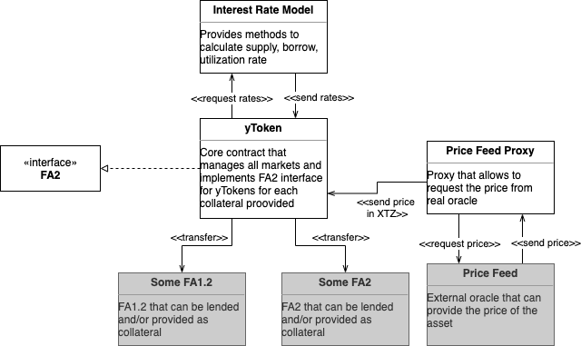

# Yupana protocol

# Description

**Yupana Protocol** is a decentralized lending protocol for individuals and protocols to access financial services. The protocol is permissionless, transparent, and non-custodial.

*Yupana Protocol contracts are under development. In this repository, you can follow the development and changes.*

# Architecture



1. `YToken` - Core contract than manages all markets and implements FA2 interface for yToken for each collateral provided;
2. `PriceFeedProxy` - Proxy that allows to request the price from real oracle;
3. `InterestRate` - Providers methods to calculate supply, borrow, utilization rate.

# Project structure

```
.
.
├──  contracts/ # contracts
├──────────  main/ # the contracts to be compiled
├───────────────────  yToken
├───────────────────  interestRate
├───────────────────  priceFeed
├──────────  partial/ # the code parts imported by main contracts
├───────────────────  interestRate/
├───────────────────────── interestRateMethods
├───────────────────────── interestRateTypes
├───────────────────  proxy/
├───────────────────────── priceFeedMethods
├───────────────────────── priceFeedTypes
├───────────────────  yToken/
├───────────────────────── adminMethods
├───────────────────────── fa2Methods
├───────────────────────── fa2Types
├───────────────────────── lendingMethods
├─────────────────────────lendingTypes
├───────────────────────── wrapTransfer
├───────────────────   mainTypes
├──  migrations/
├──  scripts/ # cli for account actions
├──  storage/ # initial storage for contract originations
├──  test/ # test cases
├──  README.md # current file
└──  .gitignore
```

# Glossary

**Underlying asset** is the real asset that is provided to the lending protocol.

**yToken token is** the single token with the specific token id inside of the core Yupana FA2; represents specific underlying asset locked in the protocol.

**Collateral** is the yToken token that can be used as the collateral to take the loan.

**Borrow** is the amount of the underlying asset  borrowed by the user(loan).

**Cash** is the amount of the underlying asset present on the contract(not borrowed).

**Reserves** is the amount of the underlying asset stored in the protocol.

**Collateral Factor** is the rate represents by which the borrow limit increases if the yToken is minted.

**Close Factor** is the max portion of the loan that can be liquidated per single transaction.

**Reserve Factor** is the rate that represents what part of the interest goes to the protocol reserves.

**Liquidation discount** is the rate that the liquidator will earn if liquidate the asset.

# Contracts

## PriceFeedProxy

- The `getPrice(asset_name)` :
    - can only be called by the **yToken** and otherwise, the transaction fails
    - requests the price from the **Price Feed** and expects the response on the `receivePrice` entrypoint.
- The `receivePrice`:
    - can only be called by the **Price Feed**.
    - the response is processed and the price is sent to the **yToken** contract.
- The `receivePrice` can only be called if the `getPrice` has been called just before in the same operation(prevent unexpected entrance and reentrancy); the `entered` flag can be used.

### Entrypoints

- getPrice - asks for a price from Oracle.
- receivePrice - sends the price from Oracle to the `yToken` contract.

## InterestRate

- The contract has the followed 3 entrypoints that can be called by anyone with the result send to arbitrary contract: `getBorrowRate(borrows, cash, reserves)`, `getSupplyRate(borrows, cash, reserves)`, `getUtilizationRate(borrows, cash, reserves)`.

### Entrypoints

- getBorrowRate - sends a callback with the counted BorrowRate.
- getSupplyRate - sends a callback with the counted SupplyRate.
- getUtilizationRate - sends a callback with the counted UtilizationRate.

## YToken

### Entrypoints

- mint - is a function to add a token as a collateral. It allows you to add a token to our system.
- redeem - the function is designed to withdraw tokens from the platform.
- borrow - a function for borrowing a token. Implemented the logic of freezing collateral tokens when borrowing a token.
- repay - a function designed to repay debt.
- liquidate - the function allows another user to liquidate someone's debt.
- enterMarket - allows you to designate that this token will be used as collateral.
- exitMarket - allows you to indicate that this token is no longer used as collateral.

# Quick Start

To compile and deploy contracts to network:
0. run `yarn`
1. compile contract `yarn compile`
2. deploy contract to chain
    - mainnet: `yarn migrate`
    - hangzhounet: `yarn migrate-hang`
    - granadanet: `yarn migrate-gra`

# Testing

Run: `yarn test`
